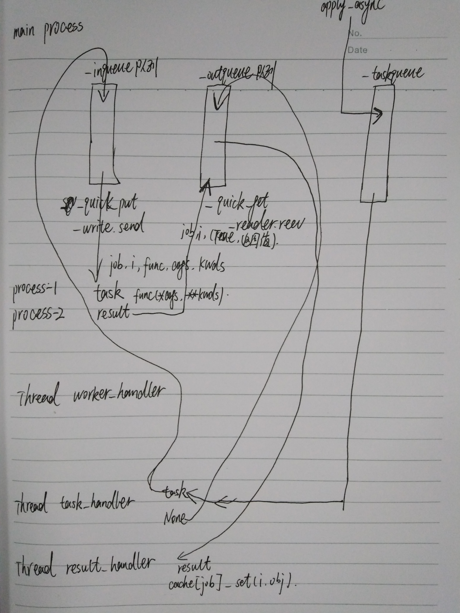

# 实现进程池，线程池，连接池等相关功能

- [实现进程池，线程池，连接池等相关功能](#实现进程池线程池连接池等相关功能)
    - [进程池的实现](#进程池的实现)
		- [进程池实现参考 multiprocessing/pool.py](#进程池实现参考-multiprocessingpoolpy)
		- [实现进程池笔记说明](#实现进程池笔记说明)
		- [相关队列和线程处理](#相关队列和线程处理如图)
		- [进程池实现的测试方法](#进程池实现的测试方法)
    - [连接池实现](#连接池实现)
		- [python web客户端连接池实现参考 urllib3’s connection pooling](#python-web客户端连接池实现参考-urllib3s-connection-pooling)
		- [php 数据库连接池实现参考](#php-数据库连接池实现参考)


####  进程池的实现

##### [进程池实现参考 `multiprocessing/pool.py`](https://github.com/python/cpython/blob/2.7/Lib/multiprocessing/pool.py)

##### [实现进程池笔记说明](process_pool.md)

##### 相关队列和线程处理如图：


##### 进程池实现的测试方法
```bash
git clone https://github.com/python/cpython.git
cd cpython
git checkout -b dev_2.7 origin/2.7  # 在Python2.7版本下执行
cd Lib
vim ./multiprocessing/process_pool.py
python -m multiprocessing.process_pool multiprocessing/process_pool.py
```

#### 连接池实现

##### [python web客户端连接池实现参考 `urllib3’s connection pooling`](https://urllib3.readthedocs.io/en/latest/reference/index.html#module-urllib3.connectionpool)
##### [php 数据库连接池实现参考](https://github.com/lanzhiwang/database_connection_pool)


